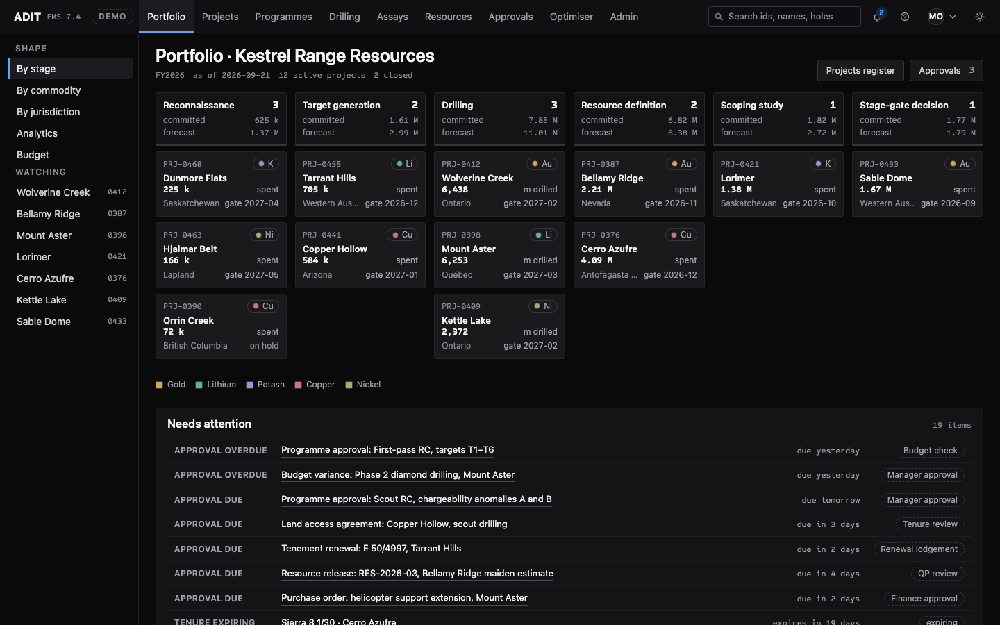
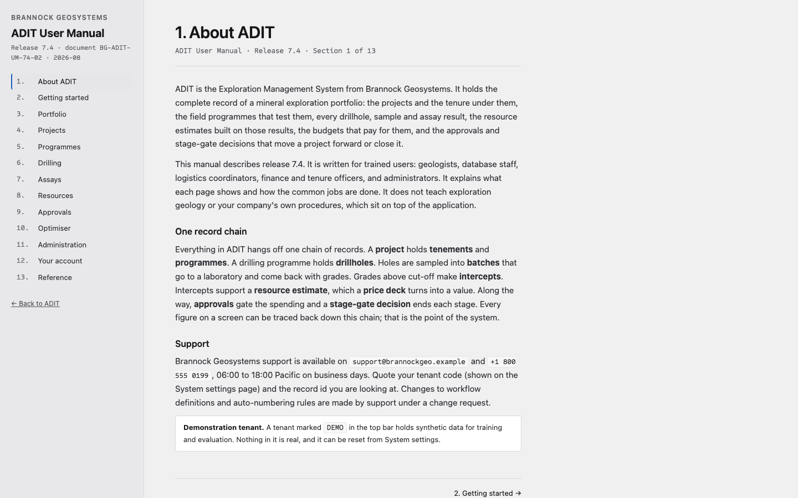

# Mockent

A mock enterprise application: **ADIT**, an exploration management system
for mineral exploration, by an invented vendor for an invented company. It is
built to feel like real specialist software: dense, full of records and
workflows, and not self-explanatory. Every project, person, assay, price and
budget in it is synthetic.

**Live:** [alejandroerickson.com/mockent/adit/](https://alejandroerickson.com/mockent/adit/)
· **User manual:** [#/manual](https://alejandroerickson.com/mockent/adit/#/manual)
· **Blog post:** [ADIT, a mock enterprise app](https://alejandroerickson.com/2026/09/25/adit-a-mock-enterprise-app.html)

[](https://alejandroerickson.com/mockent/adit/)

## What's in it

ADIT 7.4 by Brannock Geosystems, running a demonstration tenant for Kestrel
Range Resources, a mid-sized explorer with fourteen projects across five
commodities (gold, lithium, potash, copper, nickel). One chain of records runs
through the whole app: project → tenements and programmes → drillholes →
sample batches → assays → intercepts → resource estimates → value under a
price deck. Approvals gate the spending, and a stage-gate decision ends each
stage.

- **Nine sections:** Portfolio, Projects, Programmes, Drilling, Assays,
  Resources, Approvals, Optimiser, Admin. About 60 routes in all.
- **Working state.** Approve or reject requests, comment with `@`-mentions,
  assign crews (with clash detection), accept or hold assay batches, raise
  estimates, run the budget optimiser, and change system and user settings.
  Changes persist in your browser's `localStorage`; Admin → System settings
  resets the tenant.
- **Several users.** Seven people with different roles and permissions; the
  account menu switches between them in place of a sign-in.
- **A vendor user manual** in 13 sections that opens in its own tab, with its
  own layout.
- **Deterministic data.** The tenant is generated in the browser from a
  seeded random number generator (`adit/src/data/world.ts`): about 270
  drillholes, 19,700 samples with quality-control failures, 44 approvals and
  an audit trail. There is no backend.

[](https://alejandroerickson.com/mockent/adit/#/manual)

## Run it locally

Needs Node 22.

```sh
cd adit
npm install
npm run dev      # dev server
npm test         # Vitest
npm run build    # type-check and production build
```

`scripts/build-pages.sh` from the repository root reproduces what the deploy
publishes, in `_site/`.

## How it's built

Vite, React 19 and TypeScript, with hash routes so it serves as static files
from GitHub Pages. No UI library: the components are the app's own, in one
stylesheet (`adit/src/app.css`) over the design tokens in `design/tokens.css`.
Pushing to `main` runs [`.github/workflows/pages.yml`](.github/workflows/pages.yml),
which tests and builds every app folder and publishes the site.

The app was built with AI coding assistants. Some of the working records
are kept in the repository:

- [`PRODUCT.md`](PRODUCT.md) and [`DESIGN.md`](DESIGN.md): the product brief
  and the design system, in the format of the
  [impeccable](https://github.com/pbakaus/impeccable) design skill.
- [`okf/`](okf/index.md): a small knowledge bundle of the durable decisions
  and the invented world, which the assistants read before working.
  [`AGENTS.md`](AGENTS.md) is their orientation file.
- The design work used the impeccable skill, which is not committed here;
  `npx impeccable install` sets it up.

## Layout

```
adit/                the app (Vite + React + TypeScript)
design/              design tokens and the self-hosted Sometype Mono font
docs/                screenshots for this README
okf/                 the knowledge bundle
site/                the Pages root, linking to adit/
scripts/             build-pages.sh, which CI runs
.github/workflows/   the Pages deploy
.claude/ .codex/ .cursor/   the impeccable design hook, inert until impeccable is installed
AGENTS.md            orientation for coding assistants (CLAUDE.md links to it)
PRODUCT.md, DESIGN.md
```

## License

[MIT](LICENSE), except the Sometype Mono font in `design/fonts/`, which keeps
its own license (SIL Open Font License 1.1).

Brannock Geosystems, ADIT and Kestrel Range Resources are invented. Any
resemblance to a real company or product is accidental.
